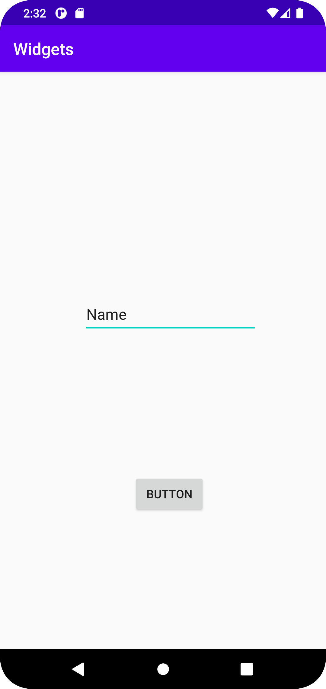

# Rapport

Jag la till tre widgets, till en constraintLayout. De widgets jag valde att lägga till en button, imageView och editText.
Därefter ändrade jag positionen på alla widgets från default positionen.

```
<ImageView
        android:id="@+id/imageView2"
        android:layout_width="wrap_content"
        android:layout_height="wrap_content"
        android:layout_marginStart="140dp"
        android:layout_marginLeft="140dp"
        android:layout_marginTop="200dp"
        android:contentDescription="@string/avatar_desc"
        app:layout_constraintStart_toStartOf="parent"
        app:layout_constraintTop_toTopOf="parent"
        tools:srcCompat="@tools:sample/avatars" />

    <EditText
        android:id="@+id/editTextTextPersonName2"
        android:layout_width="wrap_content"
        android:layout_height="wrap_content"
        android:layout_marginStart="100dp"
        android:layout_marginLeft="100dp"
        android:layout_marginTop="68dp"
        android:ems="10"
        android:inputType="textPersonName"
        android:minHeight="48dp"
        android:text="Name"
        app:layout_constraintStart_toStartOf="parent"
        app:layout_constraintTop_toBottomOf="@+id/imageView2" />

    <Button
        android:id="@+id/button"
        android:layout_width="wrap_content"
        android:layout_height="wrap_content"
        android:layout_marginStart="160dp"
        android:layout_marginLeft="160dp"
        android:layout_marginTop="484dp"
        android:text="Button"
        app:layout_constraintStart_toStartOf="parent"
        app:layout_constraintTop_toTopOf="parent" />
```

